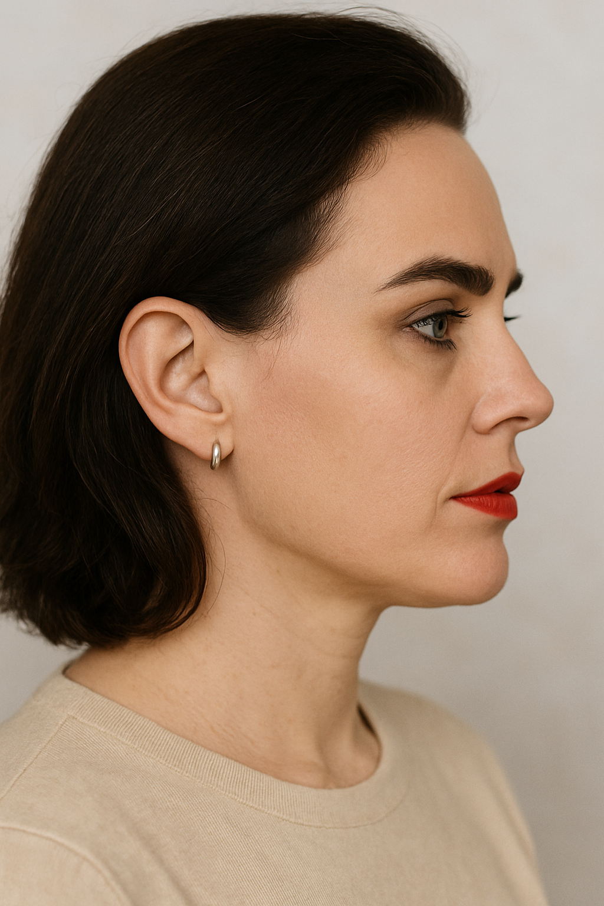
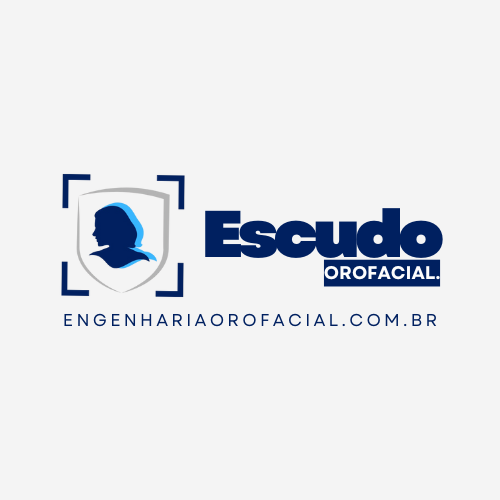
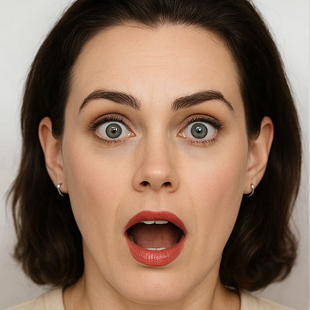
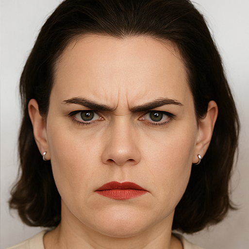
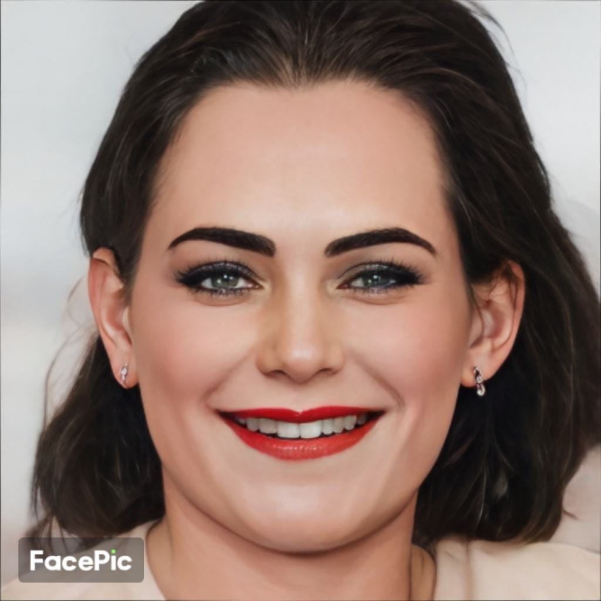
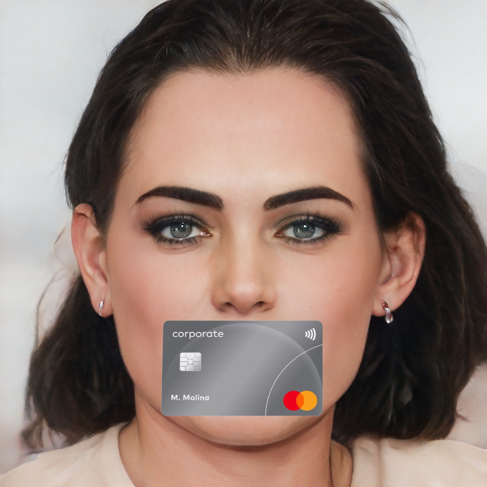
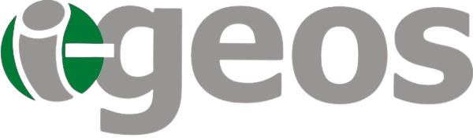
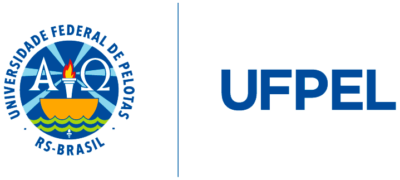
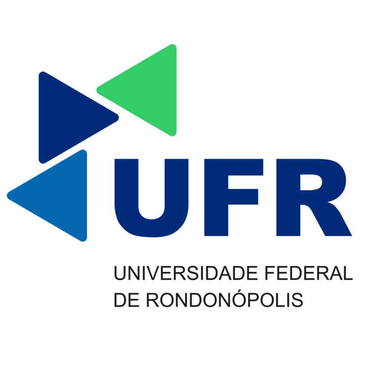
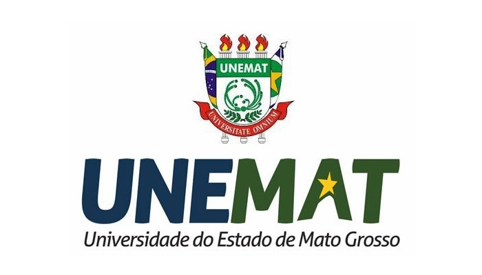

# **Módulo de Coleta Automática de Imagens Extraorais com câmeras reutilizáveis**

* fluxo técnico
* objetivos clínicos
* pipeline com **align-face**
* integração com **fer.py**
* padronização fotográfica
* uso para prontuários odontológicos

Componente Open Innovation do Ecossistema Escudo Orofacial

Este módulo foi desenvolvido para permitir a coleta automática, padronizada e reprodutível de imagens extraorais, utilizando câmeras reutilizáveis, webcams convencionais ou sistemas de captura conectados. Seu objetivo é facilitar a documentação clínica em odontologia, harmonização orofacial, estetica e pesquisa científica.

<table align="center">
  <tr>
    <td></td>  
    <td></td>
    <td></td> 
    <td></td>        
  </tr>
  <tr>
    <td></td>
    <td></td>
     <td></td>
    <td></td>
  </tr>
</table>


O módulo combina:

- detecção facial em tempo real
- alinhamento automático (align-face)
- reconhecimento de expressões com fer.py
- validação geométrica da pose (frontal / perfil direito / perfil esquerdo)
- captura automatizada sem intervenção humana
- reutilização de setups fotográficos existentes (clínicas, hospitais, universidades, SUS)

Ele nasce como uma iniciativa open innovation que reúne inovação tecnológica e impacto social através da parceria entre:
**IGEos, Fundação Banco do Brasil, UFPEL, UFR, UNEMAT - 49.452.135 Inova Simples (I.s.)** Criando um padrão nacional de documentação orofacial acessível, científica e interoperável.

<table align="center" style="border-collapse: collapse;">
  <!-- LINHA DAS LOGOS -->
  <tr>
    <td align="center" style="padding: 18px;">
      
    </td>
    <td align="center" style="padding: 18px;">
      
    </td>
    <td align="center" style="padding: 18px;">
      
    </td>
    <td align="center" style="padding: 18px;">
      
    </td>
    <td align="center" style="padding: 18px;">
      
    </td>
    <td align="center" style="padding: 18px;">
      
    </td>
  </tr>

  <!-- LINHA DOS NOMES -->
  <tr>
    <td align="center"><b>IGEos</b></td>
    <td align="center"><b>Fundação Banco do Brasil</b></td>
    <td align="center"><b>UFPEL</b></td>
    <td align="center"><b>UFR</b></td>
    <td align="center"><b>UNEMAT</b></td>
    <td align="center"><b>Inova Simples (49.452.135)</b></td>
  </tr>

  <!-- LINHA DOS LINKS (customizável) -->
  <tr>
    <td align="center">
      <a href="https://igeos.org.br" target="_blank">🔗 Site</a>
    </td>
    <td align="center">
      <a href="https://www.fbb.org.br" target="_blank">🔗 Site</a>
    </td>
    <td align="center">
      <a href="https://ufpel.edu.br" target="_blank">🔗 Site</a>
    </td>
    <td align="center">
      <a href="https://ufr.edu.br" target="_blank">🔗 Site</a>
    </td>
    <td align="center">
      <a href="https://unemat.br" target="_blank">🔗 Site</a>
    </td>
    <td align="center">
      <a href="https://engenhariaorofacial.com.br" target="_blank">🔗 Site</a>
    </td>
  </tr>
</table>
<br></br><br></br>

## 💎 1. - Sumário 
- [**Módulo de Coleta Automática de Imagens Extraorais com câmeras reutilizáveis**](#módulo-de-coleta-automática-de-imagens-extraorais-com-câmeras-reutilizáveis)
  - [💎 1. - Sumário](#-1---sumário)
  - [🎯 2. Objetivos Clínicos](#-2-objetivos-clínicos)
  - [🧠 3. Fluxo Técnico Completo](#-3-fluxo-técnico-completo)
  - [📐 4. Pipeline de Posição — Align Face](#-4-pipeline-de-posição--align-face)
  - [😃 5. Pipeline de Expressões — fer.py](#-5-pipeline-de-expressões--ferpy)
  - [🖼️ 6. Padronização Fotográfica Clínica](#️-6-padronização-fotográfica-clínica)
  - [🏛️ 7. Uso em Prontuários Odontológicos e Médicos](#️-7-uso-em-prontuários-odontológicos-e-médicos)
  - [🧩 8. Por que Câmeras Reutilizáveis?](#-8-por-que-câmeras-reutilizáveis)
  - [🌍 9. Open Innovation e Impacto Social (IGEos, Fundação BB, UFPEL, UFR, UNEMAT)](#-9-open-innovation-e-impacto-social-igeos-fundação-bb-ufpel-ufr-unemat)
  - [🚀 10. Objetivo do Open Innovation](#-10-objetivo-do-open-innovation)
  - [📦 11. Como executar](#-11-como-executar)

<br></br><br></br>

## 🎯 2. Objetivos Clínicos
- ✔️ Usar equipamentos de baixo custo e câmeras reutilizáveis, promovendo acesso em unidades públicas de saúde
- ✔️ Permitir comparações temporais confiáveis (antes / depois / acompanhamento clínico)
- ✔️ Criar um protocolo padronizado nacional de documentação facial extraoral
- ✔️ Reduzir erros de rotação, inclinação e distância
- ✔️ Padronizar fotografias clínicas para:
  - prontuários odontológicos
  - harmonização orofacial
  - perícias judiciais
  - ensino universitário
  - pesquisa científica
<br></br><br></br>

## 🧠 3. Fluxo Técnico Completo
| **Etapa**                             | **Descrição**                                     | **Ferramenta / Script**  | **Entrada**        | **Saída / Resultado**    |
| ------------------------------------- | ------------------------------------------------- | ------------------------ | ------------------ | ------------------------ |
| 🟦 **1 — Dispositivo**                 | Inicialização da câmera reutilizável / webcam.    | `device_probe.py`        | USB / Webcam       | Câmera detectada + specs |
| 🟧 **2 — Detecção Facial**             | Identificação de rosto + landmarks em tempo real. | `face_detector.py`       | Frame bruto        | Caixa facial + pontos    |
| 🟩 **3 — Align-Face**                  | Correção de rotação, pitch, yaw e centralização.  | `align_face.py`          | Landmarks          | Frame alinhado           |
| 🟨 **4 — Verificação de Pose**         | Checagem automática: frontal, perfil dir/esq.     | `pose_check.py`          | Rosto alinhado     | Pose válida (ou retorno) |
| 🟪 **5 — Reconhecimento de Expressão** | IA identifica expressão (fer.py).                 | `fer_detection.py`       | Frame alinhado     | Emoção + confiança       |
| 🟫 **6 — Gatilho Automático**          | Captura somente se pose + expressão ≥ critérios.  | `auto_capture.py`        | Dados anteriores   | JPG + metadata.json      |
| 🔵 **7 — Pós-Processamento**           | Anotações de posição, padronização clínica.       | `process_annotations.py` | Imagens capturadas | Versões anotadas         |
| 🔴 **8 — Laudo / PDF**                 | Geração do conjunto de imagens.                   | `generate_pdf.py`        | Imagens anotadas   | PDF clínico              |
| ⚫ **9 — Armazenamento**               | Salvamento local/DB + versionamento.              | `storage_manager.py`     | PDF + imagens      | Arquivo organizado       |

<br></br><br></br>

## 📐 4. Pipeline de Posição — Align Face

O align-face corrige automaticamente:
- rotação lateral (yaw)
- inclinação vertical (pitch)
- rotação axial (roll)
- centralização
- distância padrão da câmera

Parâmetros usados para considerar a imagem válida:
- Frontal neutra
  - roll < 3°
  - pitch ~ 0°
  - yaw < 5°
  - distância entre olhos dentro da faixa ideal
  - simetria entre os lados da face

- Perfil direito
  - olho direito 100% visível
  - o olho esquerdo parcialmente ou não visível
  - nariz projetado
  - queixo alinhado ao plano

- Perfil esquerdo
  - mesma lógica espelhada

Se todos os parâmetros forem aprovados → captura automática (sem clique do usuário).
<br></br><br></br>

## 😃 5. Pipeline de Expressões — fer.py

Usamos o FER (Facial Expression Recognition) para reconhecer automaticamente:

- neutral
- happy (sorriso)
- surprise
- angry
- sad
- disgust
- fear

Regra de captura:
- expressão detectada ≥ 3 frames consecutivos
- confiança > 0.85
- rosto alinhado
- iluminação aceitável
<br></br><br></br>

## 🖼️ 6. Padronização Fotográfica Clínica
Parâmetros adotados:

- ✔️ fundo neutro
- ✔️ distância fixa paciente–câmera (80–120 cm)
- ✔️ iluminação frontal difusa
- ✔️ alinhamento pelo tragus–pupila
- ✔️ ISO e exposição automáticos
- ✔️ captura automática sem interação humana

Conjunto final de imagens geradas:

- frontal_neutra.jpg
- perfil_direito.jpg
- perfil_esquerdo.jpg
- expressao_sorriso.jpg
- expressao_surpresa.jpg
- expressao_neutra.jpg
- expressao_tristeza.jpg
<br></br><br></br>

## 🏛️ 7. Uso em Prontuários Odontológicos e Médicos

As imagens seguem padrões aceitos em:
- prontuários clínicos
- documentação de ortodontia
- harmonização orofacial
- avaliações faciais
- perícias judiciais
- programas de ensino em saúde
- teleatendimento
- pesquisa científica


Cada imagem é salva com:
- timestamp
- parâmetros biométricos
- JSON de metadados
- condição da captura (pose, expressão, alinhamento)
<br></br><br></br>

## 🧩 8. Por que Câmeras Reutilizáveis?

Este módulo é desenhado para equipamentos já existentes, como:
- câmeras USB antigas
- webcams reutilizadas de laboratórios
- câmeras de consultórios
- sistemas de captura de universidades

Isso reduz custos → ideal para:
- clínicas públicas
- centros de ensino
- hubs de inovação
- projetos sociais
<br></br><br></br>

## 🌍 9. Open Innovation e Impacto Social (IGEos, Fundação BB, UFPEL, UFR, UNEMAT)

Este módulo nasce dentro de um ecossistema de inovação aberta, com objetivo de criar um padrão brasileiro de documentação facial acessível e auditável.

🤝 Parcerias envolvidas:
IGEos — Instituto de Gestão e Estratégia e Organização Social Sustentáveis
o I-GEOS tem se dedicado a implementar projetos e programas que fomentam o empreendedorismo inovador, a justiça social, e a geração de emprego e renda, sempre alinhado às necessidades e aspirações da comunidade
Fornece governança, padronização e direcionamento - Consultória Científica

💛 Fundação Banco do Brasil
Apoia iniciativas de tecnologia social e inovação para impacto nacional
Premiações Subvenções 

🏛️ UFPEL — Universidade Federal de Pelotas
Contribui com expertise científica em:
análise facial
pesquisa aplicada

🏥 UFR — Universidade Federal de Rondonópolis
Colabora com validação de softwares 

🎓 UNEMAT — Universidade do Estado de Mato Grosso
Apoia pesquisa, extensão e uso comunitário do sistema
<br></br><br></br>

## 🚀 10. Objetivo do Open Innovation
Criar um padrão nacional testado e auditável para documentação facial extraoral:

- ✔️ reduzir desigualdades tecnológicas
- ✔️ permitir uso em clínicas privadas e públicas
- ✔️ incorporar em plataformas SUS
- ✔️ permitir auditoria científica
- ✔️ interoperar com prontuários eletrônicos
<br></br><br></br>

## 📦 11. Como executar
```bash
pip install opencv-python dlib fer numpy
python auto_capture.py
```
